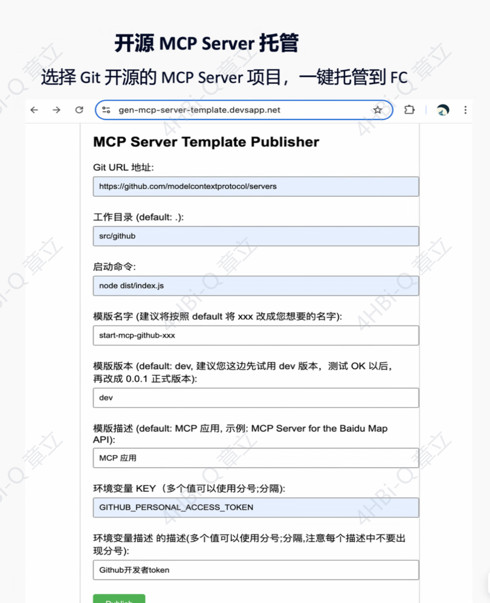
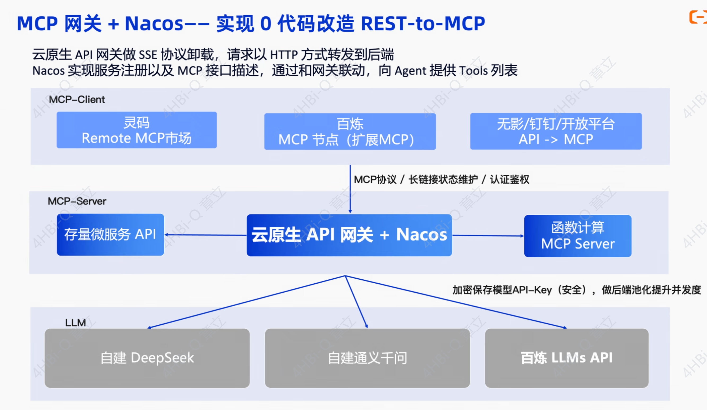
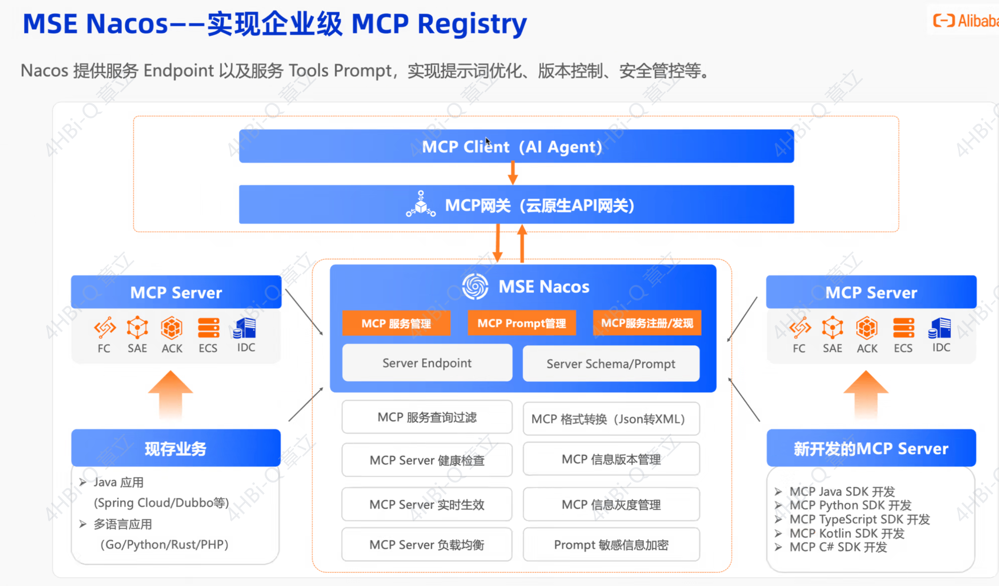
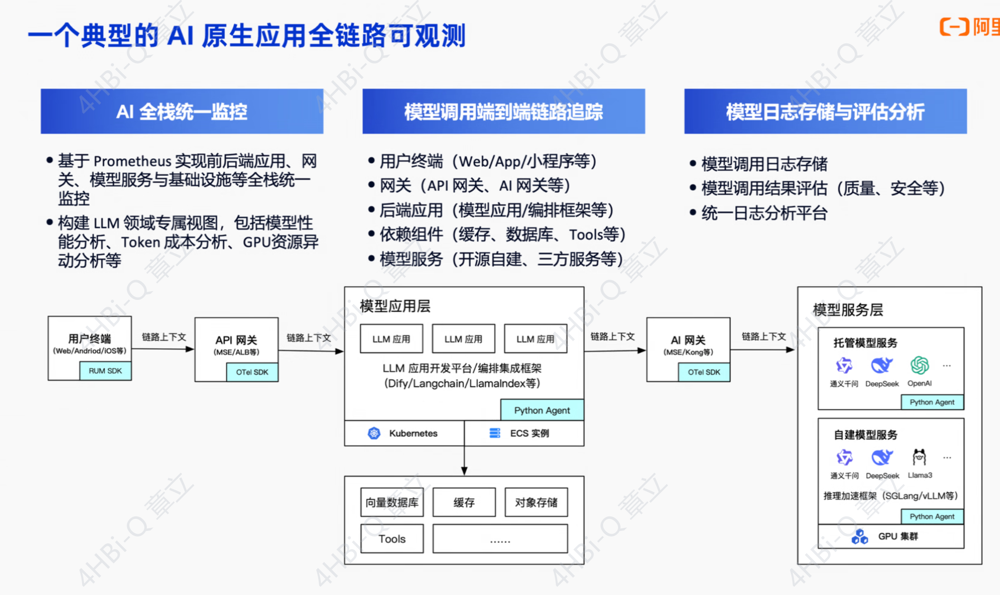

# 本地环境

## nacos

```
docker run --name nacos-standalone-derby `
    -e MODE=standalone `
    -e NACOS_AUTH_TOKEN=VGhpc0lzQVNlY3JldEtleUZvck5hY29zQURNSU4xMjM0NTY3ODk= `
    -e NACOS_AUTH_IDENTITY_KEY=nacos `
    -e NACOS_AUTH_IDENTITY_VALUE=nacos `
    -p 8080:8080 `
    -p 8848:8848 `
    -p 9848:9848 `
    -d nacos/nacos-server:latest
```

这个密钥 VGhpc0lzQVNlY3JldEtleUZvck5hY29zQURNSU4xMjM0NTY3ODk= 解码后是 ThisIsASecretKeyForNacosADMIN123456789，长度为44字节，满足至少32字节的要求

nacos-ui：http://127.0.0.1:8080


## Higress

在开始使用 MCP Server 之前，需要先部署 Higress。我们这里使用的是 all-in-one 镜像的部署方式。

Terminal window

```
# 创建一个工作目录

mkdir higress; cd higress

# 拉取最新的 Higress all-in-one 镜像

docker pull higress-registry.cn-hangzhou.cr.aliyuncs.com/higress/all-in-one:latest

# 启动 Higress，配置文件会写到工作目录下

docker run -d --rm --name higress-ai -v 123456:/data -e O11Y=on `
        -p 8101:8001 -p 8180:8080 -p 8543:8443 `
        higress-registry.cn-hangzhou.cr.aliyuncs.com/higress/all-in-one:latest
        
docker run --name higress-ai -v 123456:/data -e O11Y=on `
        -p 8101:8001 -p 8180:8080 -p 8543:8443 `
        higress-registry.cn-hangzhou.cr.aliyuncs.com/higress/all-in-one:latest        
```


监听端口说明如下：

- 8001 端口：Higress UI 控制台入口
- 8080 端口：网关 HTTP 协议入口
- 8443 端口：网关 HTTPS 协议入口

higress-ui：http://127.0.0.1:8101

账号密码：admin 123456


### 必要插件

```bash
sudo apt-get update
sudo apt-get install vim
sudo apt-get install yum
#安装 mlocate 包
sudo apt install mlocate -y
#安装后首次使用前，必须更新文件数据库
sudo updatedb 
```


### 修改配置文件

说明：这里需要重点关注address为宿主机的address

```shell
vim /data/configmaps/higress-config.yaml

data:
  higress: |-
    mcpServer:
      enable: true
      sse_path_suffix: /sse
      redis:
        address: 169.254.176.155:6379
        username: ""
        password: ""
        db: 0
      match_list: []
      servers: []
    downstream:
      connectionBufferLimits: 32768
      http2:
        initialConnectionWindowSize: 1048576
        initialStreamWindowSize: 65535
        maxConcurrentStreams: 100
      idleTimeout: 180
      maxRequestHeadersKb: 60
      routeTimeout: 0
    upstream:
      connectionBufferLimits: 10485760
      idleTimeout: 10
  mesh: |-
```


```
curl http://${higress_ai_host}:${higress_ai_port}/mcp/${your_mcp_server_name}/see

http://10.31.202.0:8180/mcp/nacosmcpserver/sse
```


# 配置

https://www.nacos.io/docs/latest/manual/user/ai/mcp-auto-register/?spm=55c5c5db.30a1e062.0.0.605922f0NH9Sz3

https://www.nacos.io/docs/latest/manual/user/ai/api-to-mcp/?spm=55c5c5db.30a1e062.0.0.605922f0NH9Sz3

### 访问

```

#使用以下命令访问

curl http://127.0.0.1:8080/mcp/nacosmcp.DEFAULT-GROUP.public.nacos/see


```


# 阿里会议灵感

serverless

nacos 3.0

higress

ragflow	,	graphrag-base on adb

dify on sae














# 兼容性问题排查


```
<!-- 截止2025.07.31，spring-cloud-starter-alibaba-nacos-config中央仓库最新版本是2023.0.3.3,该版本
依赖配置为spring cloud 3.2.x ，该版本依赖nacos-client版本为2.2.x，
然后矛盾的是 spring-ai项目必须依赖springboot3.4.x，nacos-mcp需要使用nacos-client 3.x，应该是官方现在还没来得及升级spring cloud alibaba版本
介于项目主要要使用spring-ai，spring-ai-mcp能力，所以这里需要指定版本如下
-->
<spring-boot.version>3.4.7</spring-boot.version>
<spring-cloud.version>2024.0.2</spring-cloud.version>
<nacos-client.version>3.0.2</nacos-client.version>
```


APPLICATION FAILED TO START

***************************

Description:

An attempt was made to call a method that does not exist. The attempt was made from the following location:

    org.springframework.ai.mcp.server.autoconfigure.McpServerAutoConfiguration.lambda$mcpSyncServer$4(McpServerAutoConfiguration.java:197)

The following method did not exist:

    'org.springframework.ai.tool.ToolCallback[] org.springframework.ai.tool.ToolCallbackProvider.getToolCallbacks()'

The calling method's class, org.springframework.ai.mcp.server.autoconfigure.McpServerAutoConfiguration, was loaded from the following location:

    jar:file:/D:/install/maven/dependy/repositoryali/org/springframework/ai/spring-ai-autoconfigure-mcp-server/1.0.0/spring-ai-autoconfigure-mcp-server-1.0.0.jar!/org/springframework/ai/mcp/server/autoconfigure/McpServerAutoConfiguration.class

The called method's class, org.springframework.ai.tool.ToolCallbackProvider, is available from the following locations:

    jar:file:/D:/install/maven/dependy/repositoryali/org/springframework/ai/spring-ai-core/1.0.0-M6/spring-ai-core-1.0.0-M6.jar!/org/springframework/ai/tool/ToolCallbackProvider.class
    jar:file:/D:/install/maven/dependy/repositoryali/org/springframework/ai/spring-ai-model/1.0.0/spring-ai-model-1.0.0.jar!/org/springframework/ai/tool/ToolCallbackProvider.class

The called method's class hierarchy was loaded from the following locations:

    org.springframework.ai.tool.ToolCallbackProvider: file:/D:/install/maven/dependy/repositoryali/org/springframework/ai/spring-ai-core/1.0.0-M6/spring-ai-core-1.0.0-M6.jar


```
org.springframework.ai.mcp.server.autoconfigure.McpServerAutoConfiguration
项调用    org.springframework.ai.tool.ToolCallbackProvider.getToolCallbacks

```
